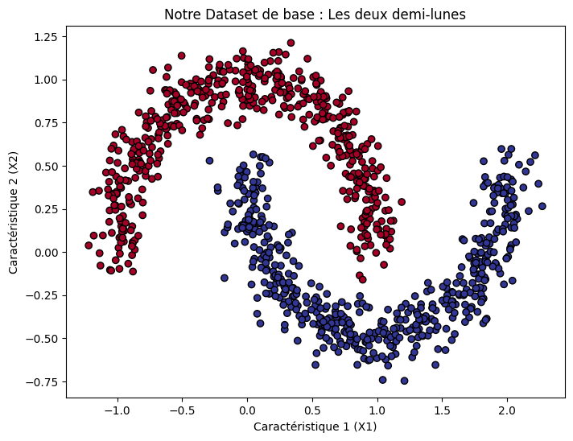
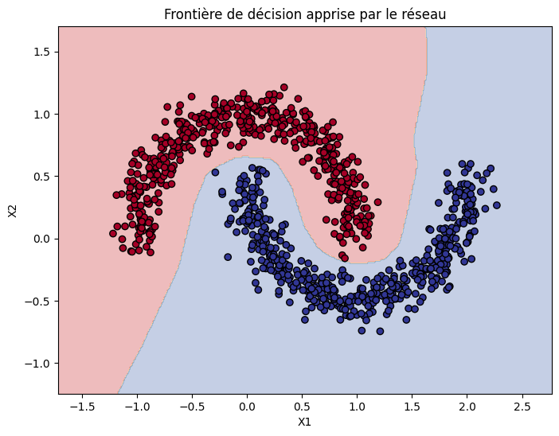
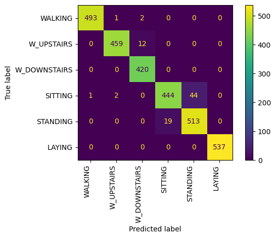
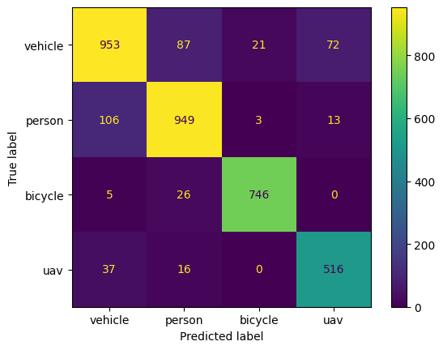

# Neural Network Journey

Welcome to my Deep Learning logbook. This repository documents my **progressive and empirical** learning path, starting from the fundamental concepts of neural networks to designing advanced industrial architectures applied to digital signal processing.

The purpose of this project is to track my progression through concrete problems of increasing complexity, focusing on physical intuition, tensor manipulation, and GPU performance optimization.

---

## 🚀 Projects Overview

### 1. Micrograd Clone (Autograd Engine from Scratch)
* **Objective:** Understand the absolute mathematical foundations of Deep Learning by implementing a scalar-valued automatic differentiation engine from scratch.
* **Implementation:** Built a custom `Value` class capable of storing scalar values, building a dynamic Directed Acyclic Graph (DAG) of mathematical operations, and executing the **Chain Rule** via a manual `.backward()` function.
* **Validated Concepts:** Forward/Backward pass mechanics, derivative formulas of basic operators (+, *, tanh, ...), and manual gradient descent without any high-level library (like PyTorch).

---

### 2. Topological Binary Classification (Two Moons)
* **Objective:** Trace a non-linear decision boundary on a two-dimensional asymmetric dataset (red and blue points shaped like interlocking half-moons).
* **Architecture:** Classic Deep Multilayer Perceptron (MLP) with non-linear activations (ReLU).
* **Validated Concepts:** Gradient backpropagation, weight initialization, decision boundary intuition.

| Initial Data Distribution (Input) | Discovered Decision Boundary (Output) |
| :---: | :---: |
|  |  |

---

### 3. Human Activity Recognition (UCI HAR Dataset)
* **Objective:** Classify 6 distinct human activities (walking, walking upstairs, walking downstairs, sitting, standing, laying) using inertial sensors (tri-axial accelerometer and gyroscope) from a smartphone.
* **Approach 1 (Statistical Features):** Training a dense linear network on a 2D tensor containing 561 pre-computed statistical features (means, standard deviations, etc.).
    * **Performance:** **96.4% accuracy** on the test set.
* **Approach 2 (Raw Temporal Signals):** Designing 1D convolutional architectures (1D CNN, 1D Inception, and 1D ResNet) processing raw time-series directly (Tensor shape: `[Batch, 9, 128]`).
    * **Performance:** **97.3% accuracy** achieved with the 1D ResNet architecture.

| Confusion Matrix - Statistical Features (96.4%) | Confusion Matrix - Raw Signals 1D ResNet (97.3%) |
| :---: | :---: |
|  |  |

---

### 4. Radar Target Classification (Micro-Doppler Signatures)
* **Objective:** Identify 4 types of moving targets (vehicle, pedestrian, cyclist, UAV/drone) from real-world radar acquisitions (Open Radar Initiative).
* **Technical Pipeline:** Temporal slicing of variable-length trajectories (*tracks*) into fixed windows of 10 spectra ($1008 \times 10$) and full pipeline migration to GPU CUDA.
* **Representation Learning:** Comparative evaluation of input signal geometry:
    1. *Power (dB)* ➔ Standard logarithmic approach (Top: 87.7% with ResNet).
    2. *Raw (Real & Imaginary)* ➔ Linear algebraic form $z = a + jb$ (Top: 72%).
    3. *Physics-Informed (Magnitude & Phase)* ➔ Polar form $z = r e^{j\phi}$ directly exposing spatial-temporal velocity gradients $\Delta \phi / \Delta t$.
* **Champion Performance:** **89% accuracy** achieved by combining the **Magnitude & Phase** representation with a **2D ResNet architecture with 4 residual blocks**, optimized using asymmetric rectangular filters tailored to the signal physics.

| Confusion Matrix - 2D ResNet (89%) |
| :---: |
|  |

---

## 📚 References & Acknowledgments

* **Micrograd Project:** Personally re-implemented based on Andrej Karpathy's educational [micrograd](https://github.com/karpathy/micrograd) repository ("From Zero to Hero" series). Licensed under MIT.
> **MIT License (MIT) Copyright (c) 2020 Andrej Karpathy**


* **UCI HAR Dataset:** Davide Anguita, Alessandro Ghio, Luca Oneto, Xavier Parra and Jorge L. Reyes-Ortiz. *A Public Domain Dataset for Human Activity Recognition Using Smartphones*. 21st European Symposium on Artificial Neural Networks, Computational Intelligence and Machine Learning, ESANN 2013.

```bibtex
@misc{human_activity_recognition_using_smartphones_240,
  author       = {Reyes-Ortiz, Jorge, Anguita, Davide, Ghio, Alessandro, Oneto, Luca, and Parra, Xavier},
  title        = {{Human Activity Recognition Using Smartphones}},
  year         = {2013},
  howpublished = {UCI Machine Learning Repository},
  note         = {{DOI}: https://doi.org/10.24432/C54S4K}
}
```

* **Open Radar Dataset:** Dataset provided by the Open Radar Initiative. 

```bibtex
@INPROCEEDINGS{Gusland,
author = {Gusland, Daniel and Christiansen, Jonas M and Torvik, B{\o}rge and Fioranelli, Francesco, and Gurbuz, Sevgi and Ritchie, Matthew},
booktitle={2021 IEEE International Radar Conference (RADAR)}, 
title = {{Open Radar Initiative : Large Scale Dataset for Benchmarking of micro-Doppler Recognition Algorithms}},
year={2021},
}
```
